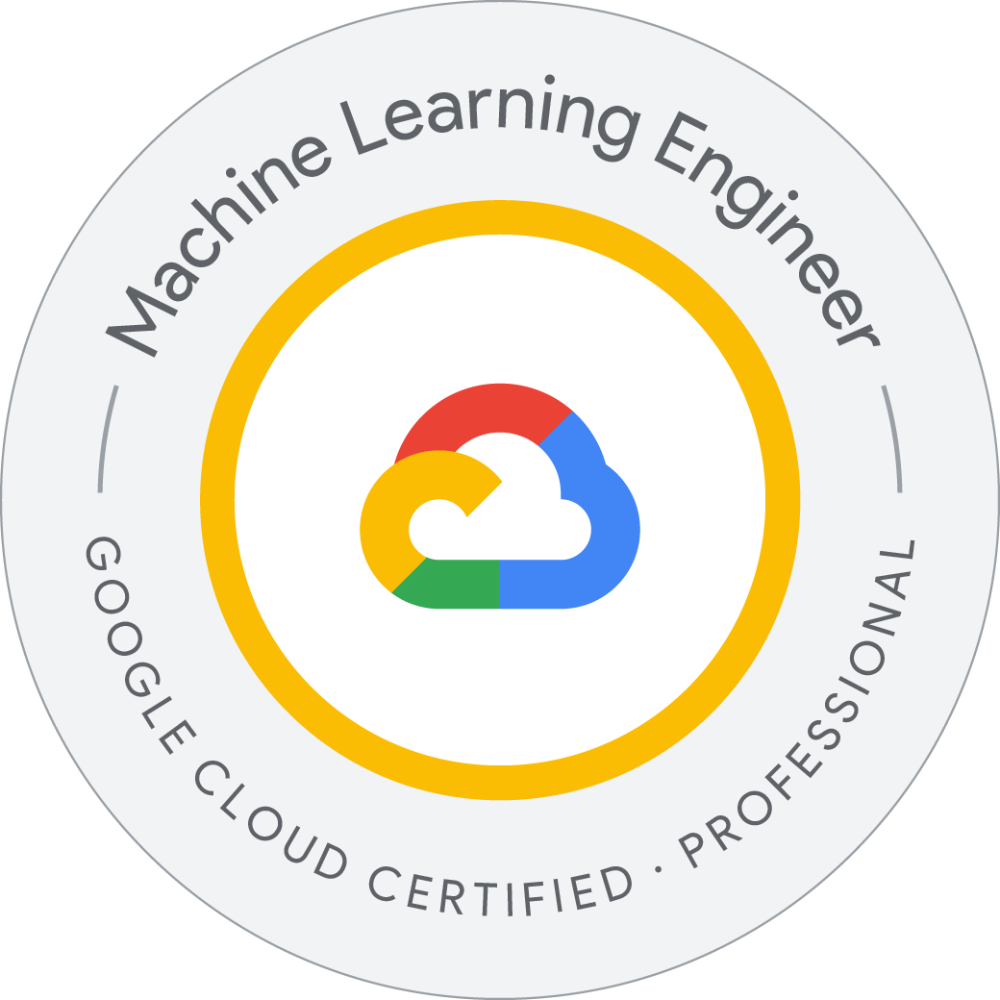


.badge { max-height:250px; width:auto; }


# About Me

I'm a software engineer driven by curiosity and a passion for lifelong learning. I enjoy tackling challenging problems and exploring new technologies to create innovative solutions. My industry experience in cloud software development, ML, machine vision, and industrial automation shapes my approach to product R&D.

Most recently, I'm co-founder and developer of [QC Hero](https://qchero.com/about), a SaaS product that helps manufacturers use ML in their quality control processes. QC Hero simplifies training ML models on massive datasets in the cloud at scale. I'm also a Google Cloud Certified Professional Machine Learning Engineer.

## Education

- **Master of Science in Software Engineering** (Software Architecture)  
  Graduated with Distinction  
  DePaul University, Chicago, IL (2019)

- **Bachelor of Science in Physics** (Minors: Mathematics, Japanese Studies)  
  DePaul University, Chicago, IL (2011)

## Skills

| Language                           | Experience | Excitement |
| ---------------------------------- | ---------- | ---------- |
| ~~JavaScript~~ Typescript          | ⭐⭐⭐⭐⚝  | 🩷🩷🩷🩷🩷 |
| Python (**with type annotations**) | ⭐⭐⭐⭐⚝  | 🩷🩷🩷🩷🩶 |

HTML, CSS, SQL, Bash

I also dabble in Go, Lua, Gleam, Java, C#, C/C++, Matlab, Arduino and more.

## Certifications

<ul>
<li>2024 - <a href="https://www.credly.com/badges/1b121c72-48ab-4b75-b99f-51d6209c40f0">Google Cloud Certified Professional Machine Learning Engineer</a></li>
<li>2021 - <a href="https://www.jlpt.jp">JLPT N3 (Japanese Language Proficiency Test)</a></li>
<li>2017 - <a href="https://www.iso.org/standard/62085.html">ISO 9001:2015 Internal Auditor</a></li>
<li>2017 - <a href="https://college.kuka.com/action?securedGetRequest=1ApuyZRdYoln8z3kR37rBLVEHisIou_rYxREV5o_FtI"> Kuka Collaborative Robot LBR iiwa Commissioning and Programming</a></li>
<li>2015 - <a href="https://learn.ni.com/pages/certified-labview-associate-developer">Certified LabVIEW Associate Developer</a></li>
</ul>

